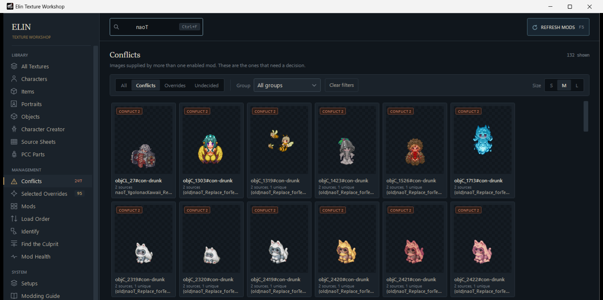
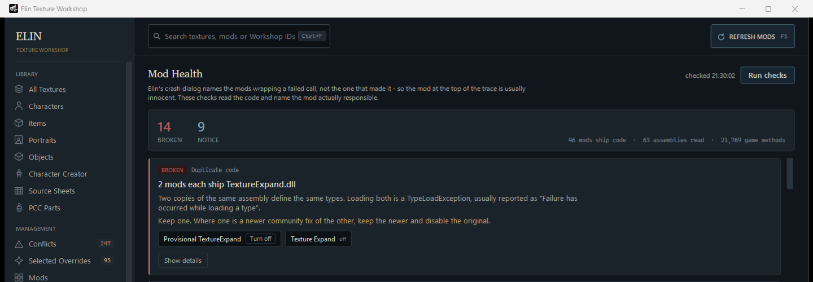
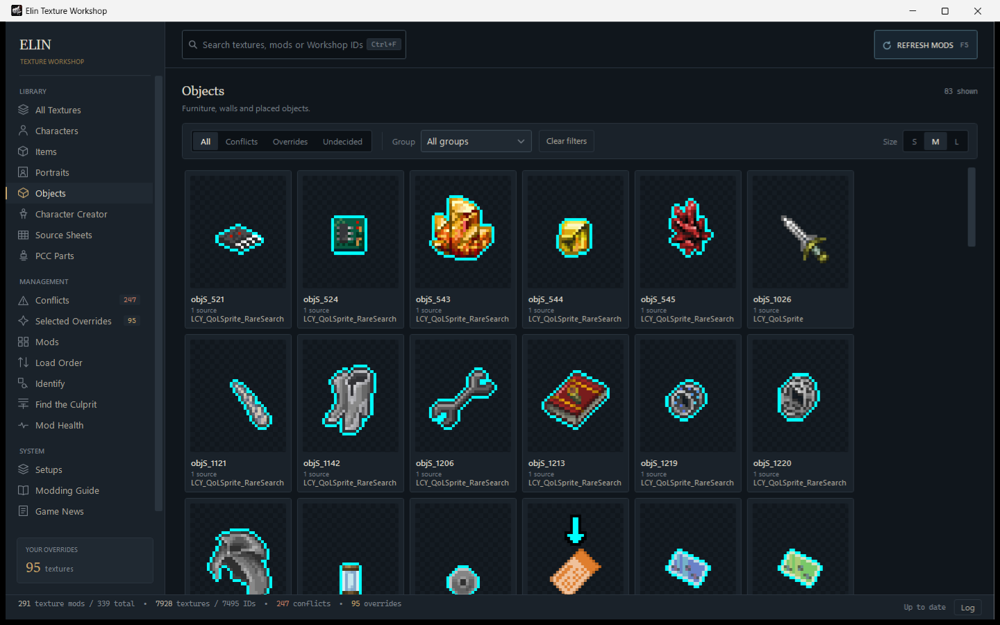
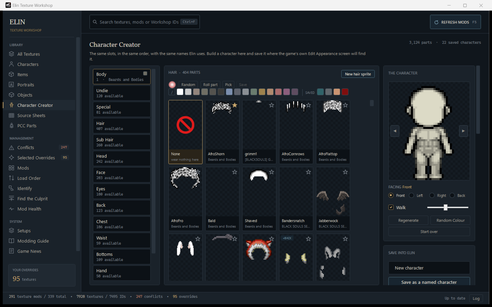

<div align="center">


# Elin Texture Workshop

**A companion app for managing texture replacement mods for [Elin](https://store.steampowered.com/app/2135150/Elin/).**

### [⭳ Download for Windows](../../releases/latest)

No installer · no account · nothing to configure

</div>

---

A Windows desktop application for managing texture replacement mods for the Steam game
**Elin**. It scans your installed Workshop mods, shows every replacement texture and
portrait visually, finds the ones supplied by more than one mod, and lets you pick exactly
which version you want — per texture, not per mod.

It is also a mod manager: mods are grouped into the same sections they were published
under on the Steam Workshop, it tells you which of them change how characters look, and a
single switch turns any of them off.

It is **not** primarily a load-order editor. Load order is included, and turning a mod off
writes to it, but the headline system is the per-texture override manager.

---

<table>
<tr>
<td width="50%"></td>
<td width="50%"></td>
</tr>
<tr>
<td><b>Conflicts</b><br>Every image supplied by more than one mod, so you can settle them one texture at a time.</td>
<td><b>Mod Health</b><br>Reads the installed code and the game's own log, and names the mod actually responsible.</td>
</tr>
<tr>
<td></td>
<td></td>
</tr>
<tr>
<td><b>Texture browser</b><br>Everything your mods replace, grouped by category and searchable.</td>
<td><b>Character Creator</b><br>Build a PCC character from parts across every mod, with a sprite editor built in.</td>
</tr>
</table>

---

## What it does

You subscribe to texture mods on the Steam Workshop. Several of them replace the same
character. Normally you would have to guess which Workshop folder holds which texture and
shuffle mod order until the right one wins.

Instead:

1. Open Elin Texture Workshop. It finds Elin and your Workshop mods on its own.
2. Click **Conflicts** to see only the textures more than one mod supplies.
3. Click a texture. Every installed version appears side by side, as images.
4. Press **USE THIS TEXTURE** on the one you want.
5. Restart Elin. That exact texture is in the game.

The chosen texture is copied into a dedicated local mod. Your Workshop folders are never
written to.

Or, when the problem is a whole mod rather than one texture:

1. Click **Mods**. Everything is grouped the way the Workshop groups it, plus sections for
   what a mod actually ships.
2. Click **Characters** to see only the mods that change how NPCs, monsters and the player
   look, with a count each.
3. Flip the switch on the ones you do not want.
4. Press **APPLY CHANGES**. `loadorder.txt` is backed up, then written.
5. Restart Elin.

---

## Features

**Texture browser**
- Grid of every replacement texture and portrait, grouped by category (Characters, Items,
  Portraits, Objects, and any other prefixes found)
- Portraits are grouped further by what their names already encode — Female, Male,
  Neutral, Named and Background — and the prefix filter lists only what the page you are
  on actually contains
- Overlay layers (`c_f-1-overlay`) are folded into the portrait they belong to instead of
  taking a tile of their own
- Transparency shown against a checkerboard, nearest-neighbour scaling for pixel art,
  aspect ratio always preserved, sprite sheets shown whole
- Conflict badges, override badges, and the mod that currently wins
- Virtualised grid, so thousands of textures stay smooth

**Comparison view**
- The current active texture large, with a stated confidence level
- Every installed version as a card: preview, mod name, Workshop ID, resolution, file
  size, SHA-256
- Pick any two and compare them side by side, with an A/B toggle for subtle differences
- Byte-identical versions are labelled as such, so you do not hunt for a difference that
  is not there

**Per-texture overrides**
- Selected textures are copied into `Elin\Package\ElinTextureManager_Overrides`
- Remove one override and Elin falls back to its normal load-order winner
- Detects when Steam updates a mod you selected from, and asks before changing anything
- Detects when you unsubscribe from a source mod, and keeps your override
- Import and export your selections as JSON, or export the whole thing as a standalone mod

**The original**
- Every version of a texture is shown against the base game's own file, read straight from
  `Package\_Elona`
- **USE THIS TEXTURE** on the original puts vanilla back without disabling a whole mod
- A mod that ships the base game's file byte for byte is labelled **SAME AS ORIGINAL**
- Where there is no original to show, it says so and says why — see
  [Which originals are available](#which-originals-are-available)

**Mods, sections and turning mods off**
- Mods are grouped into the sections they were published under on the Workshop
  (Sprite, Portrait, NPC, PCC, Item, General, QoL …), read from `<tags>` in `package.xml`
- Extra sections come from what a mod actually ships: **Characters**, **Portraits**,
  **Items**, **Objects**
- Each row says how many character sprites and portraits the mod replaces, so a
  Workshop listing that says only "Sprite" still tells you what it touches
- A switch per mod turns the whole thing off. Changes are batched, confirmed, and
  written to `loadorder.txt` behind a mandatory backup
- Each mod's own package ID, author, update date, tags and description are on the row
- Click a mod to browse only its textures; a button opens its Workshop page straight in
  the Steam app, with no sign-in of any kind

**Load order and conflicts**
- Every detected mod with image count, conflict count, unique count and load position
- Visual load-order editor with drag-and-drop, enable/disable, and a mandatory backup
  before any write

**Game news**
- Elin's own Steam announcements, so a stable update that breaks texture mods is visible
  next to the mods themselves
- Patch notes are marked as such, and the last fetch is cached for offline use
- Beside them, the mods Steam has touched most recently — purely local, no network needed
- Off-switch in Settings; see [Network access](#network-access)

**Mod Health — why is my game broken?**
- Elin's crash dialog names the Harmony patches wrapping a failed call, not the mod that
  made it, so the mod at the top of the trace is usually innocent. These checks read the
  installed code and name the one actually responsible
- Finds methods a mod calls that this version of Elin no longer has, the same assembly
  shipped by two mods, missing dependencies and version drift
- Reads the game's own `Player.log` — five thousand lines of Unity start-up that nobody
  opens — and reports the few lines that mean something: a Harmony patch that did not
  apply, a plugin installed twice, a source sheet the game found malformed
- Separates conflicts that are decisions from conflicts that are not. Where every mod
  supplies a byte-identical image there is nothing to choose
- Notices when a sprite only half agrees with itself. TextureExpand gives one character a
  different picture when it is drunk, asleep or hostile, and each of those is a separate
  file that mods argue over separately — so it is easy to settle the ordinary picture and
  leave the rest, and end up with a character drawn by one mod until it falls asleep
- Reads `loadPriority` the way the game does. Elin clamps it to −999…999 and silently
  ignores anything that is not a whole number, so a mod asking for 114514 does not load
  after everything — it ties with whatever else asked for too much

**Find the Culprit**
- Halves your mod list until the one that broke the game is the only one left, with a
  control round so an innocent mod is never named

**Identify**
- Paste a screenshot from your game and it says which mod supplies what is in it

**Character Creator**
- Build a PCC character from the parts across every installed mod, with the same slots, in
  the same order, under the same names Elin uses
- Turn it, dye it with a colour wheel or an eyedropper that picks from anywhere on screen,
  roll random parts, and save it where the game's own Edit Appearance screen will find it
- Reads the characters already saved in your game

**Sprite editor**
- Draw or edit a PCC part without leaving the application: zoom, pan, brush sizes, line,
  rectangle, ellipse, star, fill, replace-colour, undo and redo on the usual shortcuts
- The character you are building shows through behind the canvas, and can be undressed a
  piece at a time to see what you are drawing against
- A second step marks which pixels become dyeable in game, shown in red
- Saves 128×192 RGBA, four frames across by four facings down, which is what the game reads

**Portraits**
- Add your own, named the way Elin actually reads them. The game takes the group and who
  it is offered to out of the file name itself, so a portrait named anything else loads
  and is then never shown by anything
- Fits your picture to 240×320 without stretching it, and leaves it untouched if it
  already is

**Source sheets**
- Most Elin content needs no code at all — it is spreadsheets. Lists every one in your
  library and opens it in a grid
- The header, type and default rows the game reads first are kept exactly as they are, row
  numbers are the spreadsheet's own, and each column header shows what an empty cell falls
  back to
- Checks them for the mistakes the game will not report: a row with a blank id stops the
  sheet being read, and everything below it is dropped in silence
- A copy of the file is kept before every save

**Start a mod**
- Creates the folder, `package.xml` with the fields the game reads, the art folders you
  tick, and source sheets that already carry the official first three rows — worked out
  from the mods you already have, since the official sheets are not shipped with the game

**Modding guide**
- A short reference to the parts of Elin modding that go wrong quietly, with links out to
  the community's own documentation for everything else

**Everything else**
- Watches the Workshop folder and notices new, updated and removed mods (debounced, so a
  Steam download does not trigger a rescan storm)
- SQLite cache of texture metadata, so repeat launches do not re-hash every PNG
- Search across texture IDs, numbers, mod names and Workshop IDs
- Optional per-texture aliases (`objC_2115` → "Gaki")
- Named profiles of your texture choices, and setup files that move one between machines
- Minimises to the notification area, with Open, Settings, Restart and Quit
- Detects whether Elin is running and tells you to restart it, never touching the
  running game
- Dark UI, remembers window size, filters and thumbnail size

---

## Installation

1. **[Download the latest release](../../releases/latest)** — the
   `ElinTextureWorkshop-…-win-x64.zip` file.
2. Right-click the zip → **Properties** → tick **Unblock** → **OK**. Windows marks
   anything downloaded from the internet, and unblocking here saves unblocking every file
   inside it.
3. Extract the folder anywhere you like.
4. Run **ElinTextureWorkshop.exe**.
5. Optional: double-click **Create Desktop Shortcut.cmd** in the same folder to put an
   icon on your desktop, so you can start it with a double-click from then on.

That is the whole installation. There is no installer, no account, no browser component,
and nothing to configure — the application finds Elin and your Workshop mods by itself on
first launch.

The shortcut script only writes a `.lnk` file to your desktop, which is a small file
holding a path. Nothing is installed, no registry key is written, and deleting the
shortcut changes nothing. Keep the extracted folder where it is, though — the shortcut
points at it, so moving the folder afterwards will break it.

You do **not** need .NET installed. The zip is self-contained, which is why it is around
60 MB.

### "Windows protected your PC"

The first launch shows a blue SmartScreen box. Click **More info**, then **Run anyway**.

This happens because the build is not code-signed, not because anything is wrong with it.
A signing certificate costs a few hundred pounds a year, which is hard to justify for a
free modding tool. If you would rather not trust a binary from the internet — a reasonable
position — [build it yourself](#building-from-source); it takes one command.

Application data lives in `%APPDATA%\ElinTextureManager`:

```
settings.json      paths, options, window state
selections.json    your texture choices
aliases.json       custom texture names
cache.db           SQLite metadata cache
news.json          last fetched Steam announcements
Logs\              application log
Backups\           load-order backups
```

### Network access

One feature uses the network, and only that one: the **Game News** page asks Steam's
public news endpoint for Elin's announcements.

```
https://api.steampowered.com/ISteamNews/GetNewsForApp/v2/?appid=2135150
```

No API key, no account, no identifiers — the app ID and a count, nothing else. Turn it off
in Settings and the page shows whatever the last successful fetch cached. Everything else
in the application works entirely from files on your disk.

### Opening Workshop pages in Steam

**Workshop** on a mod row opens that mod's page in the Steam desktop client:

```
steam://url/CommunityFilePage/3427045108
```

There is **no Steam login, no API key and no account access anywhere in this
application**, and none is needed for this. `steam://` is a link type Steam registers on
your PC when you install it, so pressing the button hands the link to the program already
running on your machine — the same way double-clicking a text file opens your editor.
Nothing is sent anywhere, nothing about your Steam account is read, and nothing is
collected.

If Steam is not installed the button falls back to `steamcommunity.com` in your browser,
and the option can be turned off in Settings to always use the browser.

The Workshop ID is read from a Workshop folder name, which is untrusted input, so it is
checked to be all digits before it goes anywhere near the shell. Any other outbound action
is a plain `https` link opened in your browser, and nothing but `https` is ever launched.

Nothing is written inside your Steam Workshop folders.

---

## How Workshop scanning works

Elin's Steam App ID is **2135150**. The application:

1. Reads Steam's install path from the registry
   (`HKCU\Software\Valve\Steam`, falling back to `HKLM`).
2. Parses `steamapps\libraryfolders.vdf` to find **every** Steam library, including ones
   on other drives. Nothing is hardcoded to `C:`.
3. Looks for `steamapps\common\Elin` and
   `steamapps\workshop\content\2135150` in each library.
4. Walks every Workshop item looking for a folder named `Texture Replace` or `Portrait`,
   reading `package.xml` for the mod's title, author, version, load priority and tags.
5. Indexes every supported image inside those folders by **file name**, because that is
   how Elin matches a replacement.

Packages shipped with the game declare `<builtin>true</builtin>` (`_Elona`, `_ModdingKit`
and friends). Their images are the originals, not replacements of anything, so they are
never indexed as a mod's versions — otherwise every replaced portrait would look like a
two-mod conflict. They are read separately as the originals instead.

### The two replacement folders

An Elin package mirrors the layout of `Package\_Elona`, and two of its folders are
replacement points a texture mod uses:

| Folder | Addressed by | Example |
| --- | --- | --- |
| `Texture Replace` | a slot in a packed sprite atlas | `objC_2115.png` |
| `Portrait` | the vanilla file name | `UN_ashland.png` |

The same file name in each folder is two different images, so portrait IDs are namespaced
internally and an override is written back into whichever folder it came from. You never
see the namespace; the UI shows the plain name.

### Portrait groups and overlays

"Portraits" on its own is two thousand entries, so portrait names are read for what they
already encode. The structure was confirmed against the 473 files the game ships and every
portrait the installed mods add:

| Name | Group | |
| --- | --- | --- |
| `c_f-1`, `special_f_younglady` | Female | an `_f` segment |
| `c_m-12`, `guard_m-2` | Male | an `_m` segment |
| `special_n-yeek` | Neutral | `_n` — slimes, animals, machines |
| `UN_ashland` | Named | the game's prefix for unique NPCs |
| `BG_3`, `BGF_1` | Background | not a character at all |

The gender letter has to be a whole segment — an underscore, then `f`/`m`/`n`, then a
separator — which is what keeps `UN_azurlane_IJN_Ayanami` out of the neutral group. A
gender marker beats the `UN_` prefix, and a name that fits nothing lands in **Other**
rather than disappearing.

The group is carried as the portrait's *prefix*, so the grid's prefix filter becomes the
grouping. Portraits are a category by virtue of the folder they live in, so the category
is no longer derived from the prefix.

**Overlays.** `c_f-1-overlay.png` is the layer Elin draws on top of `c_f-1.png` — hair,
usually. It is not a picture in its own right, so it gets no tile of its own: it is folded
into the portrait it belongs to and offered on that portrait's page, tagged **OVERLAY**.
On a typical install that is 393 fewer tiles to scroll past.

It is still a separate file, so selecting a version on the overlay section overrides the
overlay rather than the portrait. Two consequences are handled deliberately:

- A conflict on an overlay is reported against the portrait it belongs to. Otherwise two
  mods fighting over an overlay would be counted in the sidebar but unreachable.
- An overlay with no base — none exist today, but nothing guarantees that — keeps its own
  tile rather than being hidden with no way to reach it.

### Only the prefixes that are there

The prefix filter is built from what the current page can actually show, not from the
whole library. The Portraits page offers Female, Male, Neutral, Named, Background and
Other; the Characters page offers `objC`, `objCL`, `objCLL`. Offering `objC` on the
Portraits page is an option whose only possible result is an empty grid.

Changing page drops a prefix that does not exist on the new one, so a filter carried over
from somewhere else cannot silently empty the grid.

### Workshop tags

`package.xml` carries the tags the author published under:

```xml
<tags>NPC,Sprite</tags>
```

They are author-typed free text, so spelling and casing vary (`QoL` / `Qol`, `sprite`,
`NPC Sprite`). They are normalised into fixed sections, compound tags count for each half
they name, and anything unrecognised is **not** discarded — the mod lands under **Other**
and the author's own wording stays searchable. A mod with no tags at all also lands under
**Other** rather than disappearing.

If detection fails, you can browse for the Elin folder yourself in Settings; the choice is
remembered.

### Texture identity

A file name is parsed into an ID, a prefix and a number:

```
objC_2115.png   ->   ID objC_2115   prefix objC   number 2115
```

Names that do not fit that shape (`world.png`, `objs_S_snow.png`) still get an entry —
they keep their whole name as the ID. Unknown prefixes are never discarded; they appear
under **Other** and remain filterable.

### Variants

Some mods keep alternate sets in sub-folders of `Texture Replace`, for example `unused` or
`1_Regular_Tights`. Elin loads the files sitting **directly** in `Texture Replace`, so
those sub-folder files are shown as *variants*: selectable, but not counted as active
conflicts. Selecting one copies it into your override package, which does make it active.

---

## Which originals are available

Clicking a texture shows the base game's own version of it beneath the modded ones — where
one exists as a loose file. It is worth being exact about when that is, because "no
original shown" and "there is no original" are different things and the application says
which it means.

**Available.** Anything the game ships as an individual file under `Package\_Elona`:

- every portrait in `_Elona\Portrait` (473 of them)
- the item textures in `_Elona\Texture\Item`
- the whole-sheet textures (`world.png`, `blocks.png`, `objs_S.png` …)

On a typical install this covers **every replaced portrait** — the large majority of what
a portrait pack touches.

**Not available.** The `objC_*`, `objS_*`, `objCL_*` sprites that `Texture Replace` uses.
Those name a slot inside a Unity sprite atlas packed into `Elin_Data`, and the slots are
not a uniform grid that can be derived from the loose `objs_C.png`: the indices installed
mods actually use run well past the number of cells that file holds, and cropping it at
the obvious row-major, column-major, 64px and 128px positions matches none of them.
Reading those out needs a Unity asset parser, which this application deliberately does not
carry. The comparison view says so plainly rather than showing a wrong crop.

### Putting the original back

The original is offered like any other version, so **USE THIS TEXTURE** on it copies the
base game's file into your override package. That reverts one image to vanilla without
disabling the mod that supplies it — useful when a 400-portrait pack got one character
wrong. `Package\_Elona` is opened read-only and never written to.

## Turning a whole mod off

The switch on each mod row edits `loadorder.txt`, which is the only place Elin records
whether a Workshop mod loads.

Changes are **batched**: flipping switches marks rows `NOT SAVED` and writes nothing.
**APPLY CHANGES** states how many mods go on and off, takes a timestamped backup, and only
then writes. Elin picks the change up the next time it launches.

Two cases are worth knowing:

- **A mod Steam has downloaded but Elin has not launched with yet** is absent from
  `loadorder.txt`. Absent means loaded, so enabling it is already true and writes nothing;
  disabling it appends a `…\<id>,0` line.
- **Local packages under `Elin\Package`** are never listed in `loadorder.txt` and are
  always loaded, so their switch is disabled rather than silently doing nothing.

A line the parser did not recognise is preserved verbatim and its flag is never rewritten.

## How the override system works

Global mod ordering cannot express an arbitrary per-texture choice. If Mod A has
`objC_100`, `objC_101`, `objC_102` and Mod B has `objC_100`, `objC_105`, no ordering gives
you `objC_100` from B and `objC_101` from A.

So the application maintains its own local mod:

```
Elin\Package\ElinTextureManager_Overrides\
├── package.xml
└── Texture Replace\
    ├── objC_2115.png
    ├── objC_1532.png
    └── ...
```

Selecting `objC_2115` from Mod B copies Mod B's `objC_2115.png` into that folder. The
original is opened read-only and left byte-for-byte identical.

`package.xml` follows the schema used by the packages shipped with the game
(`Package\_Elona`, `Package\_ModdingKit`):

```xml
<?xml version="1.0" encoding="utf-8"?>
<Meta>
  <title>Elin Texture Manager Overrides</title>
  <id>elintexturemanager.overrides</id>
  <author>Elin Texture Manager</author>
  <builtin>false</builtin>
  <loadPriority>999</loadPriority>
  <version>1.0.0</version>
  <description>...</description>
</Meta>
```

Elin's own packages use negative load priorities (Elin Core is `-100`, the Modding Kit is
`-90`), so a large positive value places this package last.

### Removing an override

**REMOVE OVERRIDE** deletes only the copy inside the override package. The source mod is
untouched and Elin falls back to its normal load-order winner.

---

## Why Workshop files are never modified

Steam owns those folders. It will re-download and overwrite them whenever a mod updates or
you verify your files, so any edit made there is temporary at best and destructive at
worst. The application therefore treats them as strictly read-only, and every delete is
checked before it happens. A delete must prove that the path:

1. exists and is a file, not a directory,
2. resolves underneath the configured override texture folder,
3. matches the expected file name for that selection,
4. is not inside the Workshop folder,
5. is not inside `Elin_Data`.

If any check fails the operation is refused and logged. Deletions are never recursive.

---

## How load order backups work

Elin stores its load order at `Elin\loadorder.txt`, one line per Workshop mod:

```
C:\...\steamapps\workshop\content\2135150\3427330411,1
```

The trailing field is `1` for enabled and `0` for disabled. Local packages under
`Elin\Package` are **not** listed there, which is why the override package relies on
`loadPriority` instead of a load-order entry.

Before the file is written, a timestamped copy is placed in
`%APPDATA%\ElinTextureManager\Backups`:

```
loadorder.backup_2026-08-31_201500.txt
```

If the backup fails, the save is refused. The write itself goes to a temporary file and is
then moved into place, so an interrupted save cannot truncate the original. Lines the
parser does not recognise are preserved verbatim rather than dropped. **Restore Backup**
brings back the most recent copy, backing up the current file first so a restore is itself
reversible.

### A note on priority

`loadorder.txt` records the order of your mods but does not state which end wins a file
conflict, and the game does not document it locally. The application defaults to
**later entries win**, which matches the usual convention, and says so in the UI. You can
flip it in Settings. Where a winner cannot be determined — for example when some sources
are missing from `loadorder.txt` — the application says "uncertain" instead of guessing.
Your own overrides are unaffected by this setting.

---

## Building from source

Requires the .NET 8 SDK (or newer, targeting `net8.0-windows`).

```bash
dotnet build -c Release
```

Run the tests:

```bash
dotnet test
```

Produce a self-contained build that runs without .NET installed:

```bash
dotnet publish src/ElinTextureManager.App -c Release -r win-x64 --self-contained true -o publish/win-x64
```

The result is `publish/win-x64/ElinTextureWorkshop.exe`. Single-file publishing is
deliberately not used — it causes problems with WPF dependencies, and stability matters
more here than a tidy folder.

### Cutting a release

Tag a version and push it; the workflow in `.github/workflows/release.yml` runs the
tests, publishes a self-contained build, zips it and attaches it to a GitHub Release.

```bash
git tag v1.0.0
git push origin v1.0.0
```

To build the same zip locally without tagging anything:

```bash
pwsh scripts/package-release.ps1 -Version v1.0.0
```

### The application icon

`assets/icon.png` is the source. `assets/ElinTextureWorkshop.ico` is generated from it and
holds seven sizes: 16, 24, 32, 48 and 64 as 32-bit DIBs, then 128 and 256 as PNG.

The split matters. PNG-compressed entries have been valid since Vista and Explorer renders
them, but GDI+ decodes them as noise — so an icon built entirely from PNG entries looks
right in a file listing and turns to static wherever the older API is used. Small sizes
are therefore written as DIBs.

### Project layout

```
src/ElinTextureManager.Core/   detection, scanning, indexing, overrides,
                               load order, cache, watching  (no UI dependency)
src/ElinTextureManager.App/    WPF application, MVVM
tests/ElinTextureManager.Tests/ unit tests
```

`Core` has no reference to WPF, so all the logic that touches your game folder is testable
on its own.

---

## Troubleshooting

**Elin was not found**
Settings → Elin Installation → Change, and pick the folder containing `Elin.exe` and
`Elin_Data`. Or press **Re-detect Steam and Elin**.

**No textures found**
Check the Workshop path in Settings points at
`...\steamapps\workshop\content\2135150`. Mods without a `Texture Replace` or `Portrait`
folder do not contribute images; untick "Only mods with replacement images" on the Mods
page to see everything that was detected.

**I turned a mod off but it is still in the game**
Elin reads `loadorder.txt` at launch. Restart the game. If it still loads, check the Load
Order page shows it as disabled — a mod installed by hand under `Elin\Package` is not
listed in that file and cannot be switched off from here; remove its folder instead.

**A mod I want to disable has no switch**
It is a local package under `Elin\Package`, or the override package this application
writes. Neither appears in `loadorder.txt`, so there is no flag to set.

**The original is not shown for a character sprite**
That is expected, and the panel explains it: `objC_*` sprites live inside Elin's packed
sprite atlas rather than as loose files. Portraits, item textures and the whole sheets do
show their original. See [Which originals are available](#which-originals-are-available).

**A portrait I can see in game is not in the grid**
If its name ends in `-overlay` it is a layer rather than a picture, and it lives on the
page of the portrait it belongs to — search for the name without the suffix. See
[Portrait groups and overlays](#portrait-groups-and-overlays).

**The prefix list is shorter than it used to be**
It is built from the page you are on. A prefix that no entry on this page uses is not
offered, because selecting it could only ever produce an empty grid.

**A section is missing from the Mods page**
Sections are only shown when at least one installed mod is in them, so the counts never
promise more than they deliver. A mod whose tags are not recognised — or which has no tags
at all — appears under **Other**, never nowhere.

**The News page is empty**
Either Steam could not be reached, or news is turned off in Settings. The page says which,
and shows the last cached fetch when it has one. Everything else in the application works
without a connection.

**My selected texture did not appear in game**
Restart Elin — changes only take effect at launch. If it still does not appear, try
Settings → Advanced → *Also copy overrides into `Elin\User\Texture Replace`*. That is
Elin's own user-level replacement folder and acts as a fallback. Removing an override
removes both copies.

**The wrong mod is shown as the current winner**
Settings → Load Order Priority, and flip the convention. This changes only what is
displayed; it does not change your overrides.

**A texture shows "uncertain"**
Some of its sources are not listed in `loadorder.txt`, so their relative priority cannot be
determined from local data. Selecting a version removes the ambiguity entirely.

**Two versions look the same**
They probably are. Versions with identical SHA-256 hashes are labelled
**IDENTICAL TEXTURE**, and a texture whose every version matches is called out explicitly.

**A mod is malformed**
One bad `package.xml` or corrupt PNG never stops a scan. The mod is listed with what could
be read, the problem is logged, and scanning continues. Settings → **Open Logs**.

**Steam updated a mod I had selected from**
The Selected Overrides page flags it as **SOURCE UPDATED** and offers to keep your current
override, update to the new version, or compare them. Nothing is changed without asking.

**I unsubscribed from a mod I had selected from**
Your override still works — it is a copy. The page shows **SOURCE MOD NOT INSTALLED** so
you can keep it, remove it, or choose another version.

---

## Keyboard shortcuts

| Key | Action |
| --- | --- |
| `Ctrl+F` | Focus the search box |
| `F5` | Refresh mods |
| `Escape` | Close the detail panel |

None of them are required to use the application.
